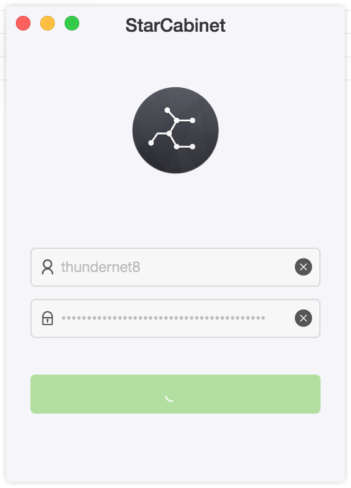
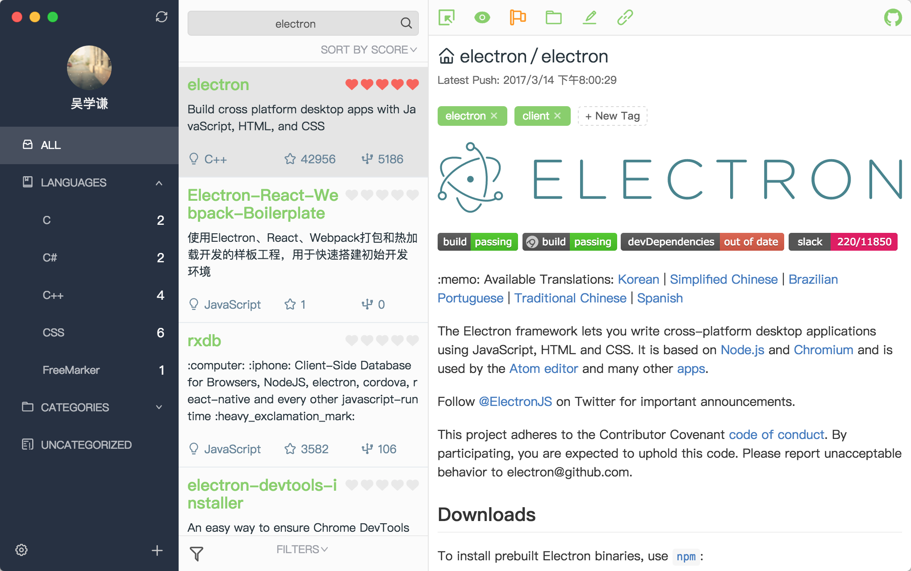

## StarCabinet

基于React/Electron/Ant Design打造的开源Github Stars管理的跨平台工具

## Features

* 归类
    * 按自带的语言分类📚
    * 自定义添加分类💼

* 标记
    * 添加仓库的标签🏷
    * 添加仓库的旗标🏁
    * 添加仓库的阅读状态👀
    * 添加仓库的备注✍️
    * 添加仓库的评分💯

* 筛选
    * 归类🎏->选择语言或者分类
    * 搜索词🔍->全部字段|仓库名|仓库原始描述|仓库备注|仓库标签
    * 排序〽️->默认(即star添加时间)|stars数量|forks数量|watchers数量|创建时间|更新时间|推送时间|评分|大小|open issues数量，均支持增序和降序
    * 过滤器⏳->未读|有旗标|有备注 三种可多选

* 离线支持
    💾利用rxdb库和浏览器的indexed db存储仓库的数据

    * 支持离线查看仓库并支持上述所有功能操作，包括readme文件的查看
    * 高效的数据条件化呈现(不用频繁请求服务器)

* 数据
    支持Stars和自定义数据的导出备份和导入恢复

## Screenshots




## Demo
[StarCabinet Demo](https://webapproach.net/starcabinet/)

## Debug
直接使用源码的用户，按如下操作:

```
npm install
npm run dev
npm start
```

如果在install packages出错，提示keytar错误等信息，特别是windows用户，你可能需要安装windows-build-tools的package之后在进行上述步骤

## LICENSE
### MIT
